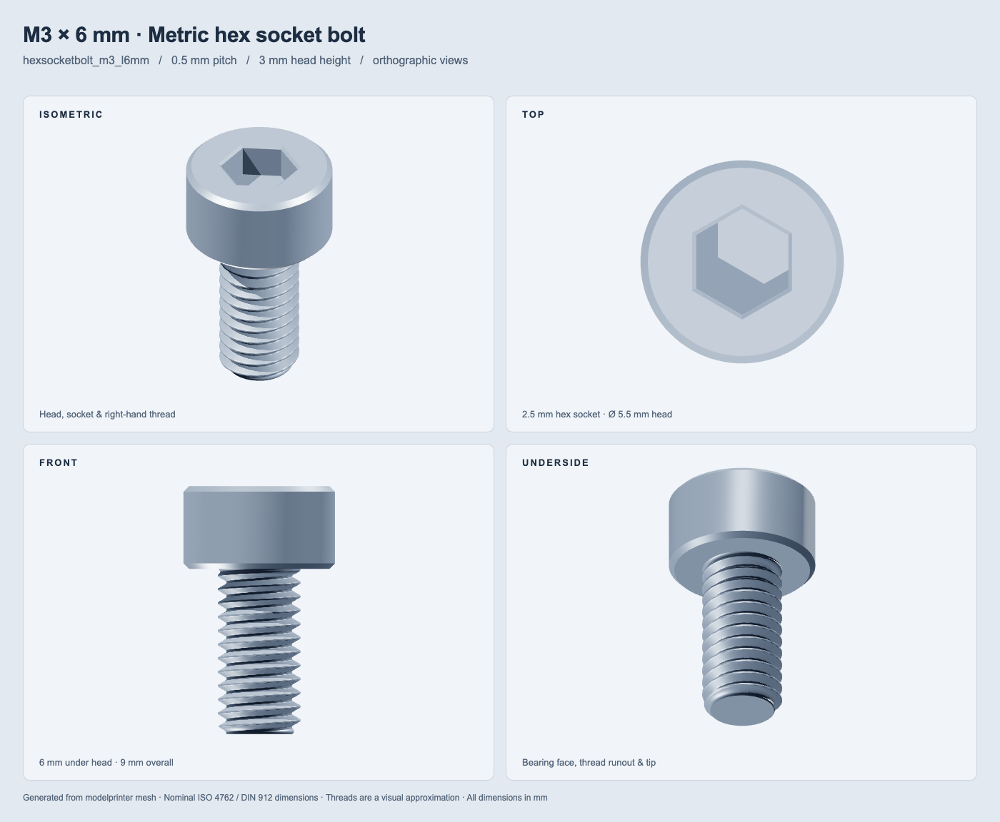

# modelprinter

Parametric CAD model strings and renderer-independent Zod schemas for
tscircuit.

`modelprinter` is an experimental companion to
[`footprinter`](https://github.com/tscircuit/footprinter). The first model is
`flexscreen`; the API deliberately resembles `fp.string(...)` so tscircuit can
initially pass these strings through its existing `cadModel` footprinter-string
path.

```ts
import { modelprinter } from "@tscircuit/modelprinter"

const model = modelprinter
  .string(
    "flexscreen_w40mm_h22.5mm_flex60mm_foldsabove_distance20mm_outset6mm",
  )
  .json()

// {
//   fn: "flexscreen",
//   width: 40,
//   height: 22.5,
//   flexCableLength: 60,
//   orientation: "foldedToFaceAboveBoard",
//   distanceAboveBoard: 20,
//   foldOutset: 6,
// }
```

As with footprinter, `.params()` exposes the unvalidated builder parameters so
callers can inspect `fn` before choosing a renderer:

```ts
modelprinter.string("flexscreen_w40mm_foldsabove").params()
// { flexscreen: true, fn: "flexscreen", w: "40mm", foldsabove: true, ... }
```

## Zod schemas

`flexScreenModelPropsSchema` models the complete public FlexScreen surface:
screen sizing, orientation shortcuts, flex and conductor geometry, fold
geometry, board references, colors, visibility, offsets, and rotations.
Lengths accept millimeter numbers or unit-bearing strings and normalize to
millimeters.

```ts
import { flexScreenModelPropsSchema } from "@tscircuit/modelprinter"

const props = flexScreenModelPropsSchema.parse({
  diagonal: "2in",
  ratio: "16:9",
  foldsBelowBoard: true,
  distanceBelowBoard: "8mm",
  foldOutset: "5mm",
})
```

The package also exports `FlexScreenModelPropsInput`,
`FlexScreenModelProps`, `FlexScreenModelDefinition`, and their constituent
schemas.

## Initial string grammar

Strings begin with `flexscreen`. Underscore-separated tokens set properties:

- Size: `w40mm`, `h22.5mm`, `diag2in`, `ratio16x9`
- Cable: `flex60mm`, `flexwidth10mm`, `conductors10`
- Orientation: `sitsflat`, `foldsabove`, `foldsbelow`, `rightangleabove`,
  `rightanglebelow`
- Fold: `distance20mm`, `foldstart9mm`, `outset6mm`, `foldsegments24`
- Visibility: `hidescreen`, `hideflex`, `hideconductors`, `hidestiffeners`
- Colors: `screencolor(#112233)`, `flexcolor(orange)`

The shorthand `distance` is only valid with `foldsabove` or `foldsbelow`, and
maps to the corresponding above/below property. Unknown tokens throw rather
than being ignored.

## Development

```sh
bun install
bun test
bun run typecheck
bun run build
```

## Metric hex socket bolts

```ts
import { mp, createHexSocketBoltMesh } from "@tscircuit/modelprinter"

const model = mp.string("hexsocketbolt_m3_l6mm").json()
// { fn: "hexsocketbolt", metricSize: "M3", length: 6, showThreads: true }

const mesh = createHexSocketBoltMesh({ metricSize: "M3", length: "6mm" })
// { positions: number[], indices: number[] }
```

`hexsocketbolt` supports M2, M2.5, M3, M4, M5, M6, M8, M10 and M12.
Both the metric size and length are required. String tokens are `m3` (or
`m2.5`, etc.), `l6mm` / `length6mm`, and optionally `nothreads` / `threads`.
Lengths accept the same units as other modelprinter models. Unknown tokens,
unsupported sizes, duplicate properties and nonpositive lengths throw.

The package exports `hexSocketBoltModelPropsSchema`,
`hexSocketBoltModelDefinitionSchema`, `metricBoltSizeSchema`,
`hexSocketBoltDimensions`, and corresponding TypeScript types. The shared
`ModelDefinition` / `modelDefinitionSchema` discriminates on `fn` for both
`flexscreen` and `hexsocketbolt`.

The dependency-free mesh generator returns indexed triangles with outward
counterclockwise winding, in millimeters. The bolt axis is Z: the head's
bearing face is at Z=0, the tip at Z=-length, and the head extends upward.
It includes a blind hex socket, head/tip chamfers and a coarse right-hand
helical thread. `showThreads: false` produces a smooth shank. Rendering
libraries can consume the mesh directly; downstream CAD viewers must register
this new model family before using its model string.

Dimensions follow the nominal head/socket sizes in the
[Bossard ISO 4762 / DIN 912 table](https://docs.rs-online.com/284d/A700000011319867.pdf).
This is visualization geometry: thread roots, manufacturing tolerances,
under-head fillets and the socket's drill-point relief are simplified. Length
is always measured **under the head**, so M3 × 6 mm is 9 mm overall. Arbitrary
positive lengths are accepted; the mesh generator limits length to 1000 thread
turns to bound memory use.

### Four-view M3 × 6 mm snapshot



Regenerate this image from the public parser and mesh generator:

```sh
bunx playwright install chromium
bun run snapshot:bolts
# Or use an existing Chromium executable:
CHROME_PATH=/path/to/chrome bun run snapshot:bolts
```

The snapshot uses Three.js only as a development renderer. The four
orthographic views show the socket, thread profile, bearing face and tip.
Tests separately verify all supported sizes, dimensions, closed mesh topology,
winding, the blind socket floor and threaded/smooth variants.
